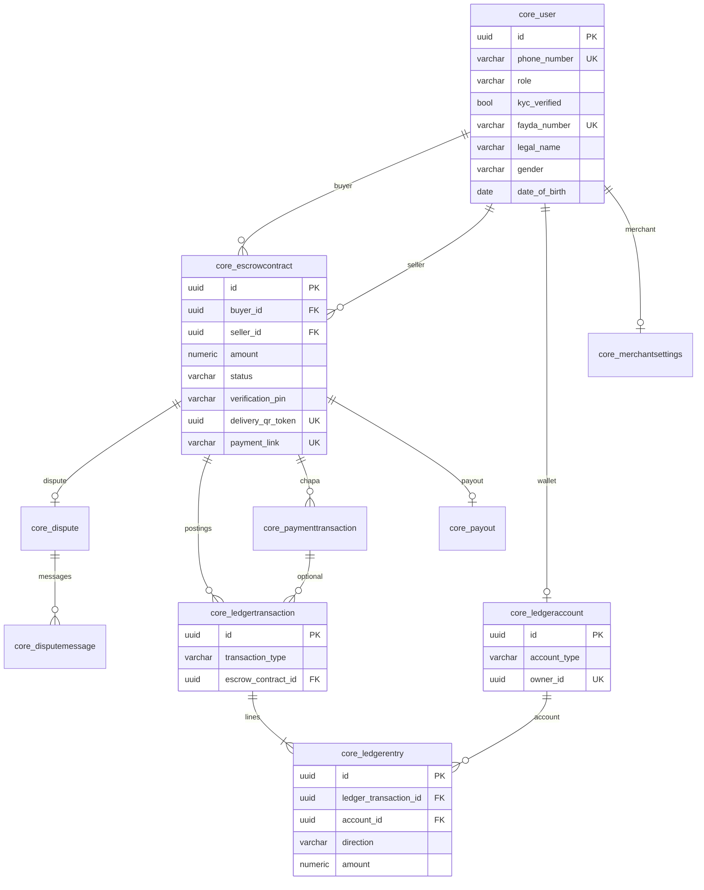

# Escrow ET database schema

Supabase PostgreSQL. Django ORM in `backend/core/models.py` is the source of truth.

## Domain tables

| Table                     | Purpose                                                                                                                            |
| ------------------------- | ---------------------------------------------------------------------------------------------------------------------------------- |
| `core_user`               | BUYER / SELLER / MERCHANT / ADMIN. Fayda signup stores `fayda_number` (unique FAN), `legal_name`, `gender`, `date_of_birth`, and sets `kyc_verified` |
| `core_escrowcontract`     | One deal. Status: `PENDING_PAYMENT` → `FUNDED` → `IN_TRANSIT` → `DELIVERED_UNVERIFIED` → `COMPLETED` (or `DISPUTED` / `CANCELLED`) |
| `core_dispute`            | One dispute per escrow                                                                                                             |
| `core_disputemessage`     | Dispute thread                                                                                                                     |
| `core_merchantsettings`   | Merchant API keys + webhook                                                                                                        |
| `core_ledgeraccount`      | User wallet (`owner_id`) or platform vault (`owner_id` NULL)                                                                       |
| `core_ledgertransaction`  | Immutable posting header: `ESCROW_FUNDED` / `ESCROW_RELEASED` / `ESCROW_REFUNDED`                                                  |
| `core_ledgerentry`        | Debit or credit line. Amount `> 0`. Debits must equal credits                                                                      |
| `core_paymenttransaction` | Chapa/mock bridge (`provider_tx_ref` unique, `raw_payload` jsonb)                                                                  |
| `core_payout`             | Seller payout after release (one per escrow)                                                                                       |

## Platform accounts (seeded)

- `PLATFORM_ESCROW_HOLDING`
- `PLATFORM_FEE_REVENUE`
- `PLATFORM_PAYOUT_CLEARING`

Balance is **not** a column. It is credits minus debits on `core_ledgerentry`. Ledger rows cannot be updated or deleted.

## Ledger postings

| Function                 | Debit        | Credit        | Escrow status after           |
| ------------------------ | ------------ | ------------- | ----------------------------- |
| `record_escrow_funded`   | buyer wallet | HOLDING       | `FUNDED`                      |
| `record_escrow_released` | HOLDING      | seller wallet | `COMPLETED` (+ payout queued) |
| `record_escrow_refunded` | HOLDING      | buyer wallet  | `CANCELLED`                   |

